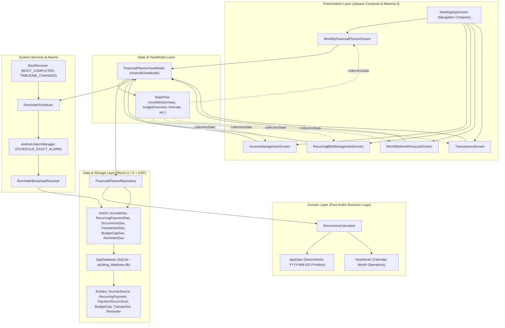
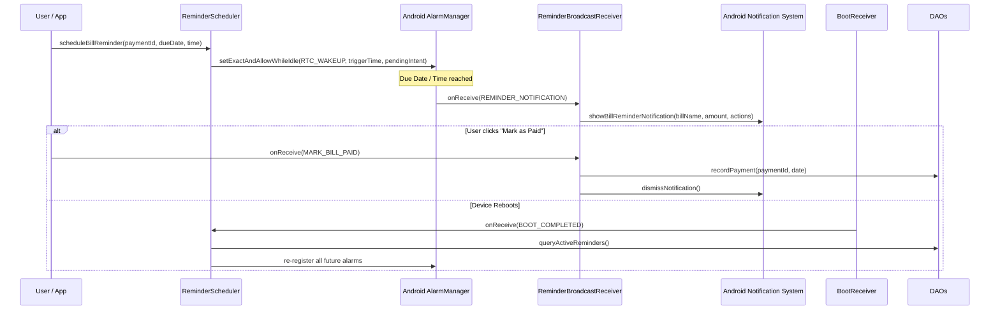

# Adulting — Architecture Documentation

This document describes the architectural foundations, design principles, data flow, domain algorithms, and database design of the **Adulting** Android application (`com.codemaverick.adulting`).

---

## 1. Architectural Philosophy

Adulting is engineered around three foundational pillars:

1. **Local-First & Privacy-Centric**: 100% of financial data lives directly on the user's physical device in a secure SQLite database via Android Room. The app functions completely offline with zero reliance on remote servers, logins, or cloud backends.
2. **Deterministic Domain Logic**: Recurrence calculations, leap-year handling, month-end date clamping, and cashflow projections are written in pure Kotlin with comprehensive unit test coverage, decoupled from Android platform classes.
3. **Reactive Unidirectional Data Flow (UDF)**: User actions flow upward through ViewModels to repositories; database mutations emit reactive streams (`Flow`) downward through ViewModels (`StateFlow`) to declarative Jetpack Compose UI trees.

---

## 2. High-Level Architecture Diagram

---

## 3. Layer Breakdown

### 3.1 Presentation Layer (`com.example.ui`)

The UI is built entirely using **Jetpack Compose** and **Material 3**.

- **Navigation Container (`AdultingAppScreen.kt`)**: Implements `AdultingAppContainer` with a Material 3 `Scaffold`, top branded app bar, and a bottom `NavigationBar`. It manages navigation between five primary destinations:
  - `PLANNER` (`/planner`): Main monthly cockpit with live income/bill totals, overdue alerts, and category distributions.
  - `INCOME` (`/income`): Multi-source income tracker, timeline, frequency setup, and income occurrence logging.
  - `BILLS` (`/bills`): Subscriptions, utilities, EMIs, and recurring payments management with inline mark-as-paid toggles.
  - `FORECAST` (`/forecast`): Multi-month forward-looking financial runway and predictive cashflow forecast.
  - `TRANSACTIONS` (`/transactions`): Ledger of completed payments and received incomes.
- **Theme (`com.example.ui.theme`)**: Dynamic Material 3 theming (`Theme.kt`, `Color.kt`, `Type.kt`) supporting Light and Dark modes with elevated surfaces and high-contrast indicators.
- **Reusable Components (`FinancialComponents.kt`, `UpcomingRecurringPaymentsList.kt`)**: Metric cards, progress bars, category icons, amount chips, and status badges.

### 3.2 State & ViewModel Layer (`com.example.ui.viewmodel`)

- **`FinancialPlannerViewModel`**: Inherits from `AndroidViewModel`. Coordinates between UI events and the repository:
  - Maintains `selectedMonth: MutableStateFlow<YearMonth>`.
  - Exposes `monthlySummary: StateFlow<MonthlyFinancialSummary>` using `flatMapLatest` to re-query repository streams when `selectedMonth` changes.
  - Exposes `budgetOverview: StateFlow<MonthlyBudgetOverview>` tracking category spending limits and threshold alerts.
  - Exposes `forecast: StateFlow<List<MonthForecast>>` for rolling future projections.
  - Emits user feedback via `uiMessage: StateFlow<String?>`.

### 3.3 Domain Layer (`com.example.domain`)

The domain layer contains zero Android dependencies and can execute inside standard JVM unit tests:

- **`AppDate`**: Lightweight, immutable representation of calendar dates (`year`, `month`, `day`) formatted as `YYYY-MM-DD`:
  - Contains deterministic date arithmetic (`plusDays`, `plusMonths`, `daysBetween`).
  - Converts safely to astronomical epoch days via civil calendar formulas without timezone drift.
  - Handles leap year validation and clamps invalid days (e.g. February 31 -> February 28/29).
- **`YearMonth`**: Immutable `YYYY-MM` month representation providing comparison, navigation (`nextMonth()`, `prevMonth()`, `plusMonths(n)`), and localized title formatting.
- **`RecurrenceCalculator`**: Core algorithmic engine:
  - `generateOccurrencesForMonth`: Evaluates recurrence rules (`ONE_TIME`, `WEEKLY`, `BIWEEKLY`, `MONTHLY`, `QUARTERLY`, `HALF_YEARLY`, `YEARLY`) against any target month.
  - `resolveEffectiveAmount`: Implements historical amount immutability (if a bill's amount changes in March, occurrences before March retain the historical amount).
  - `computeUnpaidStatus`: Deterministically marks unpaid occurrences as `OVERDUE` or `UNPAID` based on the target date.

### 3.4 Data & Persistence Layer (`com.example.data`)

#### Room Database (`AppDatabase.kt`)
- SQLite database named `adulting_database.db`.
- Database version: `2`.
- Migrations: `MIGRATION_1_2` safely provisions the `budget_caps` table with unique category indexing.

#### Entities & Schema:
- **`IncomeSourceEntity`**: Represents an income stream (e.g. Salary, Freelancing) with base amount, recurrence frequency, start/end dates, and preferred pay day.
- **`IncomeOccurrenceEntity`**: Specific instance of an income expected or received in a given month.
- **`RecurringPaymentEntity`**: A scheduled bill or subscription (e.g. Rent, Electricity, Netflix) with category, frequency, due day, and reminder configuration.
- **`PaymentOccurrenceEntity`**: Status record of a bill for a specific date (amount, paid date, payment status).
- **`BudgetCapEntity`**: Category-level spending limits with alert thresholds (e.g., alert at 80% of limit).
- **`TransactionEntity`**: Immutable financial ledger recording completed incomes and expenses.
- **`ReminderEntity`**: Scheduled notification metadata linked to recurring payments.

---

## 4. Background Services & Reminders Subsystem

### Key Components:
- **`ReminderScheduler`**: Configures exact alarms using `AlarmManager.setExactAndAllowWhileIdle()`. Sets up the high-priority `bill_reminders` notification channel.
- **`ReminderBroadcastReceiver`**: Handles alarm triggers and notification action buttons (`MARK_BILL_PAID`, `SNOOZE_BILL`).
- **`BootReceiver`**: Listens for system broadcasts (`BOOT_COMPLETED`, `MY_PACKAGE_REPLACED`, `TIME_SET`, `TIMEZONE_CHANGED`) and automatically reschedules all active alarms from the Room database.

---

## 5. Security & Privacy Model

- **No Remote Transmission**: No HTTP requests are sent containing financial details. All database interactions occur over SQLite Unix domain sockets inside the app sandbox (`/data/data/com.codemaverick.adulting/databases/`).
- **Granular Permissions**:
  - `android.permission.POST_NOTIFICATIONS`: Requested dynamically at runtime on Android 13+ (API 33+).
  - `android.permission.SCHEDULE_EXACT_ALARM`: Required for precise bill due-date notifications.
  - `android.permission.RECEIVE_BOOT_COMPLETED`: Used strictly to restore scheduled alarm timers upon device restart.
- **Secrets Isolation**: Secrets Gradle Plugin isolates optional API keys (such as `GEMINI_API_KEY`) into `.env` properties, keeping developer keys out of version control.

---

## 6. Testing Strategy

1. **Unit Tests (`app/src/test`)**:
   - `RecurrenceCalculationTest.kt`: Tests recurrence expansions across leap years, bi-weekly skips, and multi-year spans.
   - `FinancialPlannerRepositoryTest.kt`: Tests repository calculations with mock/in-memory DAOs.
2. **Robolectric Tests (`ExampleRobolectricTest.kt`)**:
   - Runs Android context-dependent tests on local JVMs without an emulator.
3. **Instrumented Tests (`app/src/androidTest`)**:
   - Tests Room database migrations (`MIGRATION_1_2`) and Compose UI flows on physical devices/emulators.
